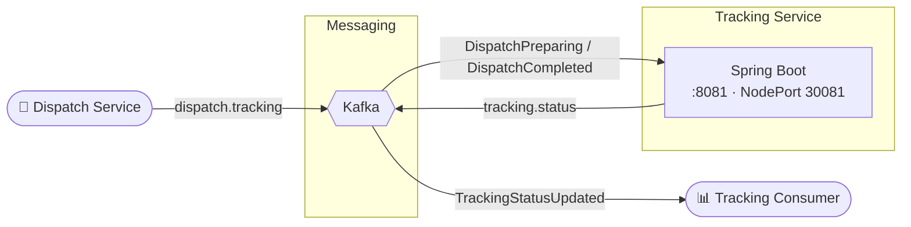

# Introduction to Kafka with Spring Boot - Tracking Service

This repository contains the code to support the [Introduction to Kafka with Spring Boot](https://www.udemy.com/course/introduction-to-kafka-with-spring-boot/?referralCode=15118530CA63AD1AF16D) online course, for the Tracking Service portion of the course.

The associated repository for the Dispatch Service can be found here:  [Dispatch Service Repository](https://github.com/dboeckli/dispatch)

The application code is for a message driven service which utilises Kafka and Spring Boot 4.

## Architecture Overview



## Testing

This application is tested with the IntelliJ runner using the `docker` profile, which starts a Docker Kafka
instance via docker compose.

> Alternative: lokale Kafka-Installation (siehe [Kafka Setup Instructions](docs/Kafka.md)).

### Docker-Profil

In IntelliJ die Run-Config **`TrackingApplication with docker`** starten (aktives Profil `docker`). Über
`spring-boot-docker-compose` startet `compose.yaml` automatisch Kafka, Wiremock und den Dispatch-Service. Kafka ist
dann über `127.0.0.1:29092` erreichbar (siehe `src/main/resources/application-docker.yaml`).

Topics auflisten:

```bash
docker exec -it kafka /opt/kafka/bin/kafka-topics.sh --bootstrap-server localhost:29092 --list
```

Kafka-Shell öffnen:

```bash
docker exec -it kafka /bin/bash
```

Terminal 1: Consumer auf `dispatch.tracking` starten

```bash
/opt/kafka/bin/kafka-console-consumer.sh --bootstrap-server localhost:9092 \
  --topic dispatch.tracking --from-beginning --property print.headers=true
```

Terminal 2: `DispatchPreparing`-Event senden

```bash
echo '__TypeId__:dev.lydtech.message.DispatchPreparing|{"orderId":"8ed0dc67-41a4-4468-81e1-960340d30c92"}' \
 | /usr/bin/kafka-console-producer --bootstrap-server localhost:9092 --topic dispatch.tracking \
   --property parse.headers=true --property "headers.delimiter=|" --property "headers.key.separator=:"
```

Terminal 2: `DispatchCompleted`-Event senden

```bash
echo '__TypeId__:dev.lydtech.message.DispatchCompleted|{"orderId":"8ed0dc67-41a4-4468-81e1-960340d30c92"}' \
 | /usr/bin/kafka-console-producer --bootstrap-server localhost:9092 --topic dispatch.tracking \
   --property parse.headers=true --property "headers.delimiter=|" --property "headers.key.separator=:"
```

Verifizieren:

- Actuator: `http://localhost:8081/actuator/health` bzw. `/actuator/info`.
- Trace/Baggage manuell auslösen: Requests aus `restRequest/actuator.http` (setzt `traceparent` und
  `baggage: testBaggage=tracking`); Logs zeigen `[… traceId-spanId]` und `MDC={testBaggage=…}`.

### Deployment with Helm

Be aware that we are using a different namespace here (not default).

To run maven filtering for destination target/helm

```bash
./mvnw clean install -Dskip.start.stop.springboot=true
```

Go to the directory where the tgz file has been created after './mvnw install'

```powershell
cd target/helm/repo
```

unpack

```powershell
$file = Get-ChildItem -Filter tracking-chart-*.tgz | Select-Object -First 1
tar -xvf $file.Name
```

install

```powershell
$APPLICATION_NAME = Get-ChildItem -Directory | Where-Object { $_.LastWriteTime -ge $file.LastWriteTime } | Select-Object -ExpandProperty Name
helm upgrade --install $APPLICATION_NAME ./$APPLICATION_NAME --namespace tracking --create-namespace --wait --timeout 8m --debug --render-subchart-notes
```

show logs

```powershell
kubectl get pods -l app.kubernetes.io/name=$APPLICATION_NAME -n tracking
```

replace $POD with pods from the command above

```powershell
kubectl logs $POD -n tracking --all-containers
```

test

```powershell
helm test $APPLICATION_NAME --namespace tracking --logs
```

uninstall

```powershell
helm uninstall $APPLICATION_NAME --namespace tracking
```

delete all

```powershell
kubectl delete all --all -n tracking
```

create busybox sidecar

```powershell
kubectl run busybox-test --rm -it --image=busybox:1.38.0 --namespace=tracking --command -- sh
```

and analyze kafka connections

```powershell
nslookup tracking-kafka.tracking.svc.cluster.local

nc -zv tracking-kafka.tracking.svc.cluster.local 29092
echo "Exit code for port 29092: $?"
```

create bitnamilegacy/kafka sidecar and open bash

```powershell
kubectl run kafka-test --rm -it --image=bitnamilegacy/kafka:3.9.0 --namespace=tracking --command -- bash
```

run kafka commands

```powershell
cd /opt/bitnami/kafka/bin
./kafka-topics.sh --bootstrap-server tracking-kafka.tracking.svc.cluster.local:29092 --list
```

Send message
Send a DispatchPreparing-Message to topic dispatch.tracking

```bash
echo '__TypeId__:dev.lydtech.message.DispatchPreparing|{"orderId":"8ed0dc67-41a4-4468-81e1-960340d30c92"}' | /usr/bin/kafka-console-producer \
  --bootstrap-server localhost:9092 \
  --topic dispatch.tracking \
  --property parse.headers=true \
  --property "headers.delimiter=|" \
  --property "headers.key.separator=:"
```

Send a DispatchCompleted-Message to topic dispatch.tracking

```bash
echo '__TypeId__:dev.lydtech.message.DispatchCompleted|{"orderId":"8ed0dc67-41a4-4468-81e1-960340d30c92"}' | /usr/bin/kafka-console-producer \
  --bootstrap-server localhost:9092 \
  --topic dispatch.tracking \
  --property parse.headers=true \
  --property "headers.delimiter=|" \
  --property "headers.key.separator=:"
```

You can use the actuator rest call to verify via port 30081

## Sandbox

Entwicklung in einer isolierten Docker-Sandbox via [opencode-sandbox-kit](https://github.com/dboeckli/opencode-sandbox-kit).
Voraussetzungen: `sbx` CLI, Secrets (`sbx secret set github` + `sbx secret set github-maven`), IntelliJ-MCP-Registrierung
(`sbx mcp add idea --url http://localhost:64615/stream --skip-ssrf-check`).

Sandbox starten (PowerShell) — **mehrzeilig**, mit `--static-mcp idea`, gepinnter Template-Version und
**read-only Host-Maven-Cache** (kein Neu-Download gecachter Dependencies):

```powershell
sbx run opencode --name tracking `
    --static-mcp idea `
    --kit "git+https://github.com/dboeckli/opencode-sandbox-kit.git#dir=opencode-agent" `
    -t docker/sandbox-templates:opencode-docker-0.5.0 `
    "C:\development\projects\tracking" `
    "$env:USERPROFILE\.kube:ro" `       # optional: Kubernetes (kubectl/helm im Docker-Desktop-Cluster)
    "C:\development\maven-repo:ro"      # read-only Host-Maven-Cache (kein Neu-Download gecachter Deps)
```

Claude-Variante (Home):

```powershell
sbx run claude --name tracking `
    --static-mcp idea `
    --kit "git+https://github.com/dboeckli/opencode-sandbox-kit.git#dir=opencode-agent" `
    -t docker/sandbox-templates:claude-code-docker-0.5.0 `
    "C:\development\projects\tracking" `
    "C:\development\maven-repo:ro"
```

Mammouth (Template-Pin steckt im spec-Image, kein `-t`):

```powershell
sbx run mammouth --name tracking `
    --kit "git+https://github.com/dboeckli/opencode-sandbox-kit.git#dir=mammouth-agent" `
    "C:\development\projects\tracking" `
    "C:\development\maven-repo:ro"
```

> **Sandbox-Quirk:** Vor jedem `./mvnw` in der Sandbox `export npm_config_bin_links=false` (Spotless/prettier bricht sonst mit EPERM im gemounteten Workspace).

